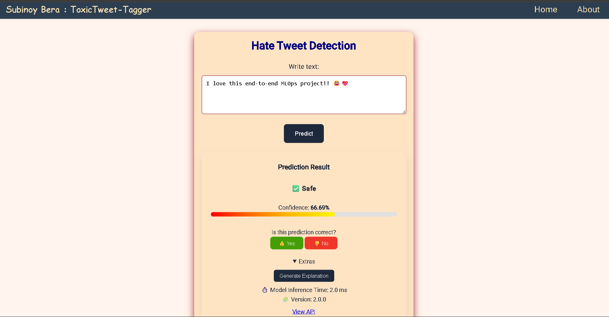
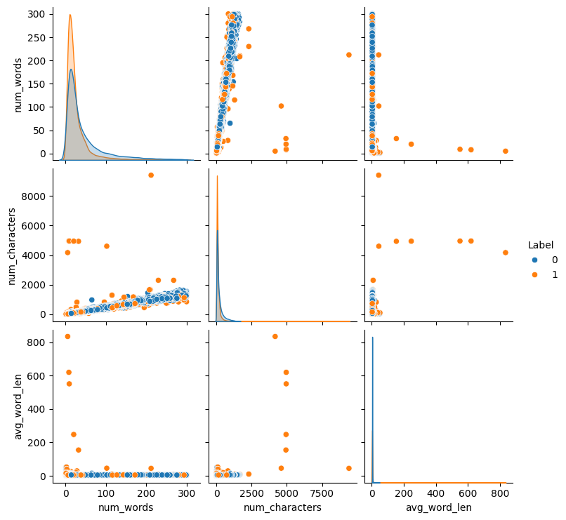
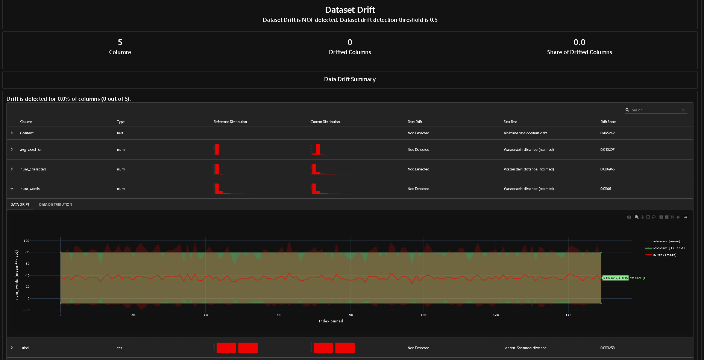
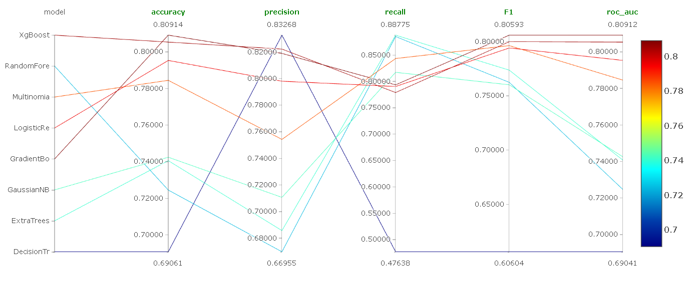
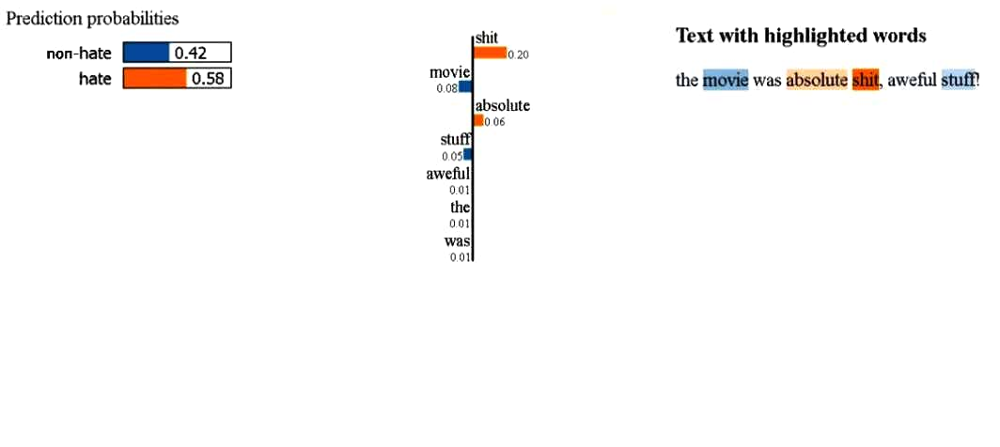

# Toxic-Tweet Tagger

## 📑 Technical System Documentation :

<u><b>End to End Production-Grade Hate Speech Detection Application</b></u>

The Toxic Tweet Tagger is a production-oriented machine learning system designed to detect hate speech and toxic content in social media text. Unlike <b>typical ML Demos</b> that focus only on model training and accuracy, this project aims to represent <b>real-world production level workflows!</b> It covers the <b>complete lifecycle</b> from developing <b>core ML pipeline</b>, implementing <b>MLOps principles</b>, creating <b>inference API</b>, including <b>automated testing, experimentation tracking, CI/CD, monitoring</b> and much more! Built to demonstrate how industries deploy ML solutions at scale, - ensuring <b> scalability </b>, <b>reproducibility</b> and <b> maintainability </b>. <br>
In essence, its <b>not just about building a machine learning model</b> with some fancy accuracy — it is about building a <b>complete ecosystem</b> around the model. It demonstrates how to design an ML system in line with best practices used by ML teams and Engineers in <b>production environments</b>.

The system covers the complete lifecycle of an ML application:
- Data ingestion and validation.
- Model training and experimentation.
- Model versioning and registry management
- Automated testing and CI pipelines
- Containerized inference services
- Deployment and monitoring readiness

## ✍️ Highlights :

- 📂 <b>End-to-End ML Pipeline</b> – Complete ML lifecycle starting from data ingestion and preprocessing to model training, evaluation. Every stage is modular and reusable, making the pipeline easy to extend or adapt to new datasets.

- ⚓ <b>Data Drift check with Evidently</b> – Right after data ingestion, Evidently is used for data validation to ensure data quality, schema consistency, and distribution checks. This helps catch potential issues early and ensures only valid data flows into the training pipeline.

- ✒️ <b>Data & Pipeline Tracking with DVC</b> – Datasets, artifacts, and pipelines are all tracked with DVC, providing transparency, version control, and detecting changes in any data or pipeline. Prevents recomputation if no changes are detected.

- 🔍 <b>Experiment Tracking, Model Versioning & Registration in MLflow</b> – Every training run is logged with metrics, hyperparameters, artifacts, and model versions, ensuring that results are fully reproducible and enabling easy comparison of experiments. Models are also saved in the model registry with stages for reproducibility and identification which model is currently at production.

- 🧪 <b>Automated Testing & Code Quality Checks</b> – The project is production-hardened with unit tests, integration tests, and linting/formatting tools. CI ensures that code remains clean, reliable, and maintainable at scale.

- ⌛ <b>CI/CD Automation with GitHub Actions</b> – The pipeline is integrated with continuous integration and deployment, enabling automatic testing, model retraining, and deployment with every new update, following true MLOps principles.

- ⚡ <b>FastAPI Inference Service</b> – A high-performance REST API built with FastAPI for real-time predictions. Designed with scalability in mind- it provides the production-ready serving layer that is containerized and deployed in HuggingFace Spaces.

- 🔭 <b>Model Explainability with LIME</b> – Integrated LIME (Local Interpretable Model-agnostic Explanations) to interpret individual predictions and understand why the model made a decision. This improves transparency, trust, and debuggability of the deployed ML system.

- 🖥️ <b>Monitoring-ready Architecture</b> – Used logging and exception modules for proper tracking and error handling. While Evidently is already used at data validation, the system is also designed to extend monitoring into production with Prometheus and Grafana, continuous drift detection, performance tracking, and retraining triggers.

- 🧩 <b>Scalable, Modular and Industry-Grade Design</b> – Developed and engineered following best practices from modern ML teams, ensuring the project is maintainable, extensible, and future-proof, going far beyond typical portfolio ML demos.

## 🛠️ Tech Stack :

- <b>Languages</b> : Python, Jupyter | HTML, CSS, JavaScript (for UI development)
- <b>ML /DL/ NLP</b> : Pandas, numpy, scipy, scikit-learn, nltk, tensorflow
- <b>MLOps Tools</b> : Github Actions, Docker, MLflow, DVC, Evidently, Prometheus
- <b>Database</b> : MongoDB Atlas
- <b>API & Serving</b> : FastAPI, HuggingFace spaces (model inference server)
- <b>Testing & Code Quality</b> : tox, pytest, black, flake8, mypy
- <b>Deployment</b> : Vercel

## 🚀 Version 2.0 Update :
- Inference time reduced from ~200 ms to <10 ms.
- Implemented feedback and prediction explanation services.
- Exposes Prometheus metrics endpoint for monitoring and visualization using Grafana dashboards.
- API architecture improvements and UI enhancements.
- Implemented buffered message queues and worker processes to handle background tasks asynchronously, reducing API latency and improving overall system scalability.

## 🎯 Application Preview :

<p>
    
</p>

## 🔗 Links :

- ### [Visit App ↗️](https://toxic-tweet-tagger.vercel.app/)
- ### [Hugging Face 🤗](https://huggingface.co/Subi003)

📌 <b>PLEASE NOTE</b> :
This project focuses on Machine Learning engineering, MLOps, and model deployment aspects rather than full-stack web development.
The application interface is built using basic HTML & CSS only, just enough to demonstrate how end users can interact with the deployed model.
<br> The core emphasis of this work is on:

* Data pipeline design.
* Model versioning & experiment management with MLflow.
* MLOps best practices (CI/CD, testing, observability, deployment)

Despite several optimizations, it might still have latency issues and cold start delays up to 5-10 secs.
<b> 📍 All open source tools and free services have been used to develop this application!! 🙏✨</b>
<br>

## 📊 Experiment Results :

<p>
    
    
    
    
    </p>
</p>

## ⚙️ Installation :

STEP: 01 - Clone this repository

```cmd
git clone https://github.com/SubinoyBera/ToxicTweet-Tagger
cd ToxicTweet-Tagger
```

STEP: 02 - Create and activate conda environment

```bash
conda create -p venv python=3.11.5 -y
conda activate venv
```

STEP: 03 - Install project requirements. <br>
To run the application, only install the app requirements

```bash
pip install -r app/requirements.txt
```

For development or running ML pipeline, install the full dev requirements

```bash
pip install uv  # Using uv for fast download [Optional]
uv pip install -r requirements-dev.txt
```

STEP: 04 - Build the package

```bash
python -m build
```

STEP: 05 - If you want to try out the ML pipeline, perform this step only; otherwise, please `skip this` and go directly to `STEP: 06`. <br>
Create a `.env` file in the root directory and add the required environment variables as mentioned in the given `.env.example` file. Make sure you have accounts in Dagshub, MongoDB Atlas, and HuggingFace. Get your hate-tweet dataset, perform EDA, experiments, and upload it to MongoDB. Update the files in the `src/` folder with your implementation and model parameters in the `params.yaml` file. Run this command to execute your ML pipeline :

```bash
dvc repro
```

STEP: 06 - Run the Application

```bash
python run_frontend.py
```

Open your browser and open the local URL : `http://localhost:8000/`.<br>
Write your comment and click on the `predict` button. Click on "Extra Details" to get more info.

<hr>

### 💥 Future Updates :
1. Deploying the application in production-grade servers (AWS).
2. Upgrading model performances using transformer-based models such as BERT or RoBERTa.
3. Implement automated model retraining pipeline and data drift detection in production.
4. Adding request rate limiting and API security
<br>

🎗️🙏 **THANK YOU !!** :) <br>
<b>-_with love & regards : Subinoy Bera (developer)_</b><br>
🧡🤍💚
