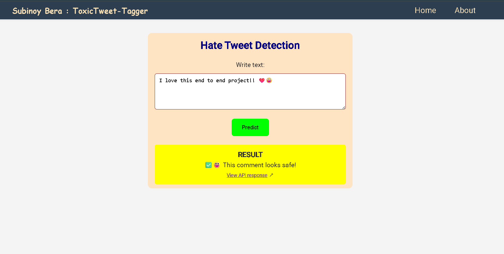
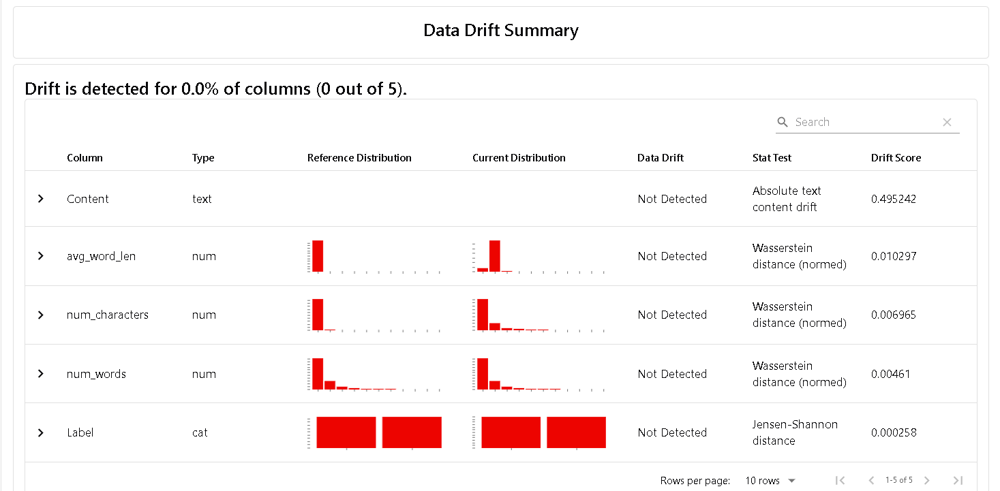

# Toxic-Tweet Tagger

## ⭐ Overview :

<u><b>End to End Production-Grade Hate Speech Detection Application</b></u>

Unlike <b>typical ML Demos</b>, this project aims to represent <b>real-world production level workflows!</b> It covers the <b>complete lifecycle</b> from developing <b>core ML pipeline</b>, implementing <b>MLOps principles</b>, creating <b>inference API</b>, including <b>automated testing, experimentation tracking, CI/CD</b> and much more! Built to demonstrate how industries deploy ML solutions at scale, - ensuring <b>scalibility</b>, <b>reproducibility</b> and <b>maintainablity</b>. <br>
In essence, its <b>not just about building a machine learning model</b> with some fancy accuracy — it is about building a <b>complete ecosystem</b> around the model. It demonstrates how to design a ML system following the best practices used by ML teams and Engineers in <b>production environments</b>.

## 🚀 Highlights :

- 📂 <b>End-to-End ML Pipeline</b> – Complete ML lifecycle starting from data ingestion and preprocessing to model training, evaluation. Every stage is modular and reusable, making the pipeline easy to extend or adapt to new datasets.

- ⚓ <b>Data Drift check with Evidently</b> – Right after data ingestion, Evidently is used for data validation to ensure data quality, schema consistency, and distribution checks. This helps catch potential issues early and ensures only valid data flows into the training pipeline.

- 🔗 <b>Data & Pipeline Tracking with DVC</b> – Datasets, artifacts and pipeline all are tracked with DVC, providing transparency, version-control and detect changes in any data or pipeline. Prevents recomputation if no changes is detected.

- 🔍 <b>Experiment Tracking, Model Versioning & Registration in MLflow</b> – Every training run is logged with metrics, hyperparameters, artifacts, and model versions, ensuring that results are fully reproducible and enabling easy comparison of experiments. Models are also saved in model registry with stages for reproducibility and identification which model is currently at production.

- 🧪 <b>Automated Testing & Code Quality Checks</b> – The project is production-hardened with unit tests, integration tests, and linting/formatting tools. CI ensures that code remains clean, reliable, and maintainable at scale.

- ⌛ <b>CI/CD Automation with GitHub Actions</b> – The pipeline is integrated with continuous integration and deployment, enabling automatic testing, model retraining, and deployment with every new update, following true MLOps principles.

- ⚡ <b>FastAPI Inference Service</b> – A high-performance REST API built with FastAPI for near real-time predictions. Designed with scalability in mind- it provides the production-ready serving layer that is containerized and deployed in HuggingFace Spaces.

- 🔭 <b>Model Explainability with LIME</b> – Integrated LIME (Local Interpretable Model-agnostic Explanations) to interpret individual predictions and understand why the model made a decision. This improves transparency, trust, and debuggability of the deployed ML system.

- 🖥️ <b>Monitoring-ready Architecture</b> – Used logging and exception modules for proper tracking and error handling. While Evidently is already used at data validation, the system is designed to extend monitoring into production with prometheus and grafana, continuous drift detection, performance tracking, and retraining triggers.

- 🧩 <b>Scalable, Modular and Industry-Grade Design</b> – Developed and engineered following best practices from modern ML teams, ensuring the project is maintainable, extensible, and future-proof, going far beyond typical portfolio ML demos.

## 🛠️ Tech Stack :

- <b>Languages</b> : Python, Jupyter | HTML, CSS (for frontend)
- <b>ML /DL/ NLP</b> : Pandas, numpy, scipy, scikit-learn, nltk, tensorflow
- <b>MLOps Tools</b> : Github Actions, Docker, MLflow, DVC, Evidently
- <b>Database Store</b> : MongoDB Atlas
- <b>API & Serving</b> : FastAPI, HuggingFace spaces (model inference server)
- <b>Testing & Code Quality</b> : tox, pytest, black, flake8, mypy
- <b>Deployment</b> : Vercel

## 🎯 Application Preview :

<p>
    
</p>

## 🔗 Links :

- ### [Visit App ↗️](https://toxictweet-tagger.vercel.app)
- ### [Hugging Face 🤗](https://huggingface.co/spaces/Subi003/ToxicTagger_serveAPI/tree/main)

📌 <b>PLEASE NOTE</b> :
This project focuses on Machine Learning engineering, MLOps, and model deployment aspects rather than full-stack web development.
The application interface is built using basic HTML & CSS only, just enough to demonstrate how end users can interact with the deployed model.
<br> The core emphasis of this work is on:

* Data pipeline design.
* Model versioning & experiment management with MLflow.
* MLOps best practices (CI/CD, testing, observability, deployment)

Used LIME for model observability, which increased inference time to more than 5 secs! Performed optimization and reduce it arround 0.7 secs. Still it can have latency issues and cold start delays upto 10 secs.<br>
<b> 📍 All open source tools and free services have been used to develop this application!! 🙏✨</b>
<br>

## 📊 Experiment Results :

<p>
    
    
    
    
    </p>
</p>

## ⚙️ Installation :

STEP: 01 - Clone this repository

```cmd
git clone https://github.com/SubinoyBera/ToxicTweet-Tagger
cd ToxicTweet-Tagger
```

STEP: 02 - Create and activate conda evironment

```bash
conda create -p venv python=3.11.5 -y
conda activate venv
```

STEP: 03 - Install project requirements. <br>
For running the application, only install app requiremnts

```bash
pip install -r app/requirements.txt
```

For development or running ML pipeline, install the full dev requirements

```bash
pip install uv  # Using uv for fast download [Optional]
uv pip install -r requirements-dev.txt
```

STEP: 04 - Build the package

```bash
python -m build
```

STEP: 05 - If you want to try out the ML pipeline then only perform this step, else please `skip this` and directly go to `STEP: 06`. <br>
Create a `.env` file in the root directory and add the required environment variables as mentioned in the given `.env.example` file. Make sure you have accounts in Dagshub, MongoDB Atlas and HuggingFace. Get your hate-tweet dataset, perform EDA, experiments and upload it to MongoDB. Update the files in the `src/` folder with your implementation and model parameters in the `params.yaml` file. Run this command to execute your ML pipeline :

```bash
dvc repro
```

STEP: 06 - Run the Application

```bash
python run_app.py
```

Open your browser and open the local URL : `http://localhost:8000/`.<br>
Write your comment and click on `predict` button. To view the full respose from the model inference API click on the link shown below the prediction result: `view API response`

<hr>

### 💥 Upcoming Update :

Event Driven System Architecture with Kafka backbone for scalability, high performance and low latency with monitoring using prometheus and grafana. Also improving both model and system performance overall for creating a robust ML system.
<br>

🎗️🙏 **THANK YOU !!** :) <br>
<b>-_with love & regards : Subinoy Bera (developer)_</b><br>
🧡🤍💚
