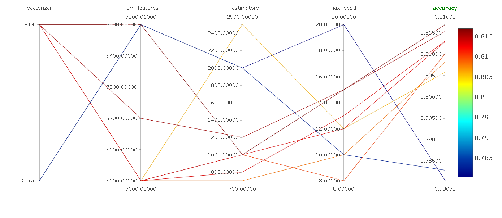

# Toxic-TweetTagger

## ⭐ End to End Production Grade Hate Speech Detection Application 

Unlike <b>typical ML Demos</b>, this project aims to represent <b>real-world production level workflows!</b>   It covers the <b>complete lifecycle</b> from developing <b>core ML pipeline</b>, implementing <b>MLOps principles</b>, creating <b>inference API</b>, including <b>automated testing, experimentation tracking, CI/CD</b> and much more! Built to demonstrate how industries deploy ML solutions at scale, - ensuring <b>scalibility</b>, <b>reproducibility</b> and <b>maintainablity</b>.  
In essence, its <b>not just about building a machine learning model</b> with some fancy accuracy — it is about building a <b>complete ecosystem</b> around the model. It demonstrates how to design a ML system following  the best practices used by ML teams and Engineers in <b>production environments</b>.

## 🚀 Features / Highlights :

* 📂 <b>End-to-End ML Pipeline</b> – Complete ML lifecycle starting from data ingestion and preprocessing to model training, evaluation. Every stage is modular and reusable, making the pipeline easy to extend or adapt to new datasets.

* ⚓ <b>Data Drift check with Evidently</b> – Right after data ingestion, Evidently is used for data validation to ensure data quality, schema consistency, and distribution checks. This helps catch potential issues early and ensures only valid data flows into the training pipeline.

* 🔗 <b>Data & Pipeline Tracking with DVC</b> – Datasets, artifacts and pipeline all are tracked with DVC, providing transparency, version-control and detect changes in any data or pipeline. Prevents recomputation if no changes is detected. 

* 🔍 <b>Experiment Tracking, Model versioning & Model Registry in MLflow</b> – Every training run is logged with metrics, hyperparameters, artifacts, and model versions, ensuring that results are fully reproducible and enabling easy comparison of experiments. Models are also saved in model registry with stages for reproducibility and identification which model is currently at production.

* 🧪 <b>Automated Testing & Code Quality Checks</b> – The project is production-hardened with unit tests, integration tests, and linting/formatting tools. CI ensures that code remains clean, reliable, and maintainable at scale.

* 🚀 <b>CI/CD Automation with GitHub Actions</b> – The pipeline is integrated with continuous integration and deployment, enabling automatic testing, model retraining, and deployment with every new update, following true MLOps principles.

* ⚡ <b>FastAPI Inference Service</b> – A high-performance REST API built with FastAPI for near real-time predictions. Designed with scalability in mind- it provides the production-ready serving layer that is containerized and deployed in HuggingFace Spaces.

* 🔭 <b>Model Explainability with LIME</b> – Integrated LIME (Local Interpretable Model-agnostic Explanations) to interpret individual predictions and understand why the model made a decision. This improves transparency, trust, and debuggability of the deployed ML system.

* 🖥️ <b>Monitoring-ready Architecture</b> – Used logging and exception modules for proper tracking and error handling. While Evidently is already used at data validation, the system is designed to extend monitoring into production with prometheus and grafana, continuous drift detection, performance tracking, and retraining triggers.

* 🧩 <b>Scalable, Modular and Industry-Grade Design</b> – Developed and engineered following best practices from modern ML teams, ensuring the project is maintainable, extensible, and future-proof, going far beyond typical portfolio ML demos.

## 🛠️ Tech Stack :

* <b>Languages & Core</b>: Python, Jupyter | HTML, CSS (for frontend)
* <b>ML /DL/ NLP</b>: Pandas, numpy, scipy, scikit-learn, nltk, tensorflow 
* <b>MLOps Tools</b>: Github Actions, Docker, MLflow, DVC, Evidently
* <b>Database</b>: MongoDB Atlas

* <b>API & Serving</b>: FastAPI, HuggingFace spaces (model inference server)
* <b>Testing & Code Quality</b>: tox, pytest, black, flake8, mypy
* <b>Deployment</b>: Vercel 

## 🎯 Experiment Results :

    
    <vr>
    

## 📌 Preview :

    
    <vr>
    

